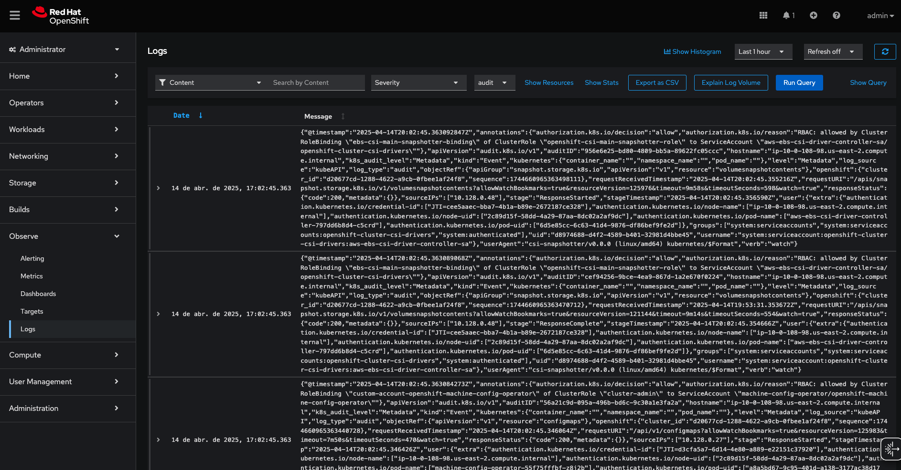

# ClusterLogForwarder Configuration in OpenShift

This document describes the process of configuring ClusterLogForwarder to forward OpenShift logs to Loki.

## Prerequisites

OpenShift 4.17

The following operators must be installed:
- OpenShift Data Foundation Operator
  - May be necessary to create a StorageSystem
  - StorageSystem takes several minutes to become available
- Red Hat OpenShift Logging Operator
- Loki Operator
- Cluster Observability Operator

## Configuration

### 1. Storage Configuration

First, we create an ObjectBucketClaim to store the logs:
- Creates a bucket in ODF/NooBaa
- Automatically generates access credentials

To create the ObjectBucketClaim:
```
oc apply -f 01-bucket-claim.yaml
```

Set up access variables:
```
AWS_ACCESS_KEY_ID="$(oc extract -n openshift-logging secret/obc-loki --keys='AWS_ACCESS_KEY_ID' --to=-)"
AWS_SECRET_ACCESS_KEY="$(oc extract -n openshift-logging secret/obc-loki --keys='AWS_SECRET_ACCESS_KEY' --to=-)"
BUCKET_NAME="$(oc get objectbucketclaim obc-loki -n openshift-logging -o jsonpath='{.spec.bucketName}')"
```

### 2. Loki Configuration

- Creation of a secret with storage credentials

```
cat <<EOF | oc apply -f - 
apiVersion: v1
kind: Secret
metadata:
  name: logging-loki-s3
  namespace: openshift-logging
type: Opaque
stringData:
    bucketnames: "${BUCKET_NAME}"
    endpoint: "https://s3.openshift-storage.svc"
    access_key_id: "${AWS_ACCESS_KEY_ID}"
    access_key_secret: "${AWS_SECRET_ACCESS_KEY}"
    region: "us-east-1"
EOF
```

- LokiStack deployment

```
oc apply -f 02-loki-stack.yaml
```

- UI Plugin configuration for log visualization

```
oc apply -f 03-ui-plugin.yaml
```

### 3. Collector Configuration

Create dedicated ServiceAccount:
```
oc create sa collector -n openshift-logging
```

Assign necessary roles:
```
oc adm policy add-cluster-role-to-user logging-collector-logs-writer -z collector -n openshift-logging
oc adm policy add-cluster-role-to-user collect-application-logs -z collector -n openshift-logging
oc adm policy add-cluster-role-to-user collect-audit-logs -z collector -n openshift-logging
oc adm policy add-cluster-role-to-user collect-infrastructure-logs -z collector -n openshift-logging
```

### 4. Cluster Log Forwarder Configuration

Create the Cluster Log Forwarder configuration with the Service Account created before.

```
oc apply -f 04-cluster-log-forwarder.yaml
```

## Usage

After configuration, audit logs can be viewed through the OpenShift Console in the Observability section. To view application and infrastructure logs, uncomment lines 26 and 27 in the ClusterLogForwarder.

